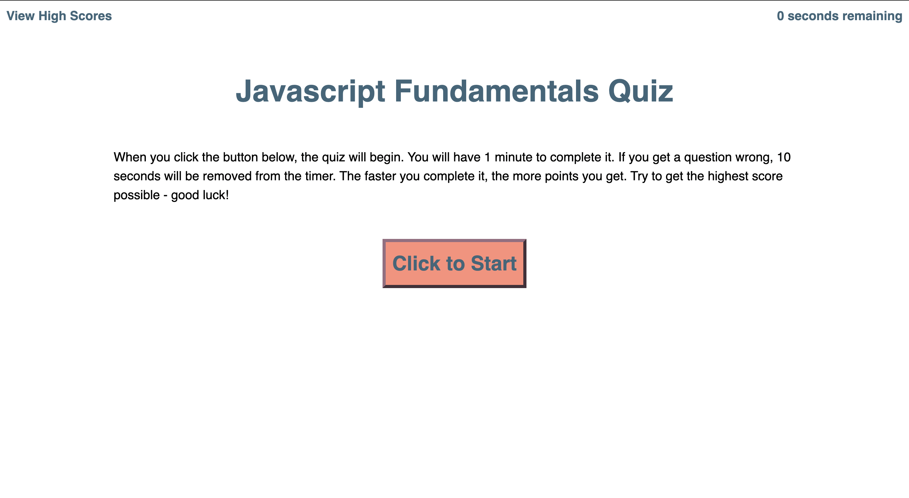
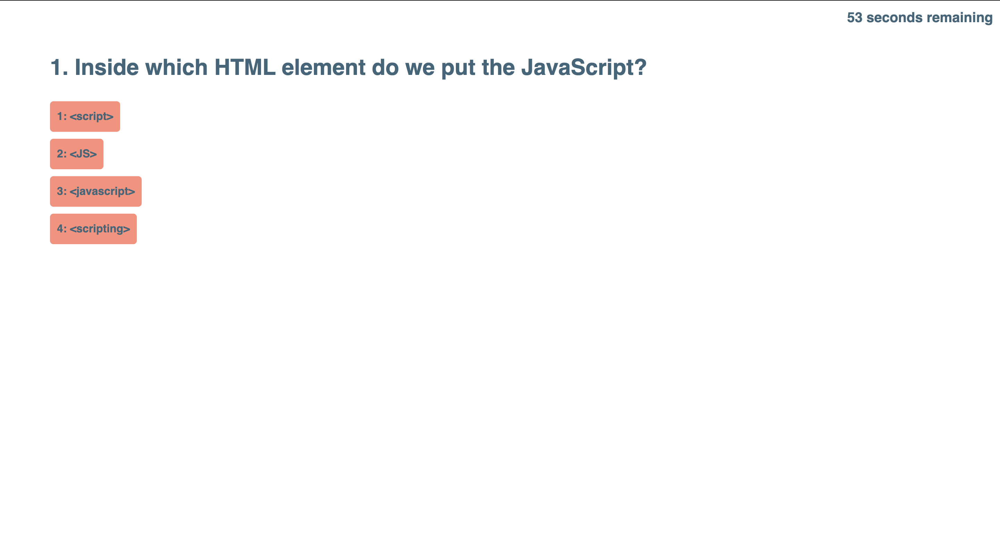
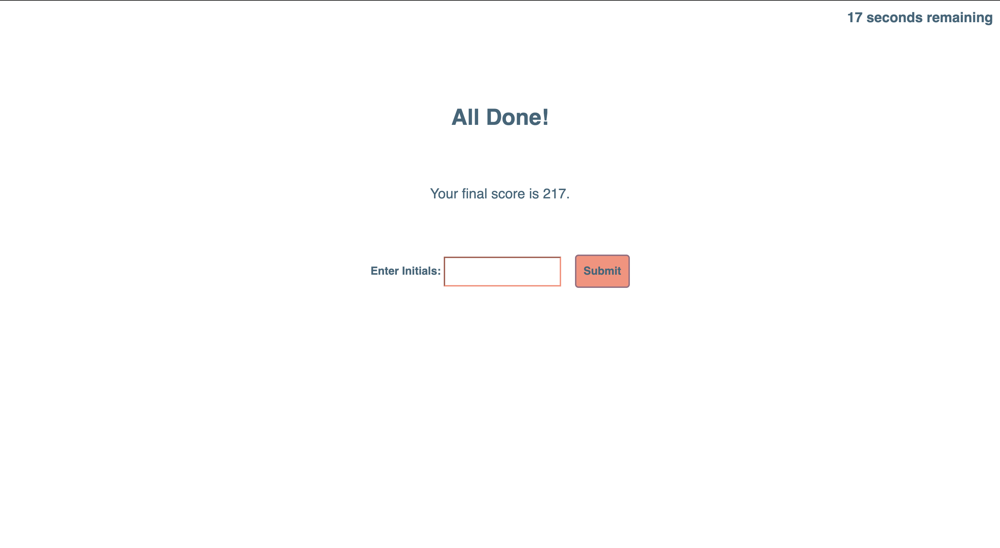
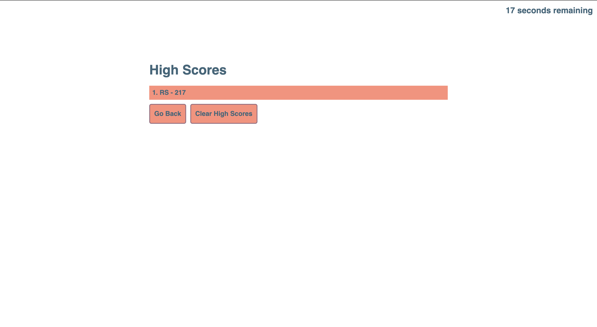

# JavaScript Quiz

## Description

Users can brush up on their JavaScript knowledge by taking a brief quiz on sime of the fundamentals. Useful for veterans and novices alike, users can keep track of their progress via their high scores.

## Installation

There is no installation required to use this webpage.

## Usage

By clicking on the Start button, a series of multiple-choice questions will appear. Users can click on any of the four answers. There is also a timer displayed on screen. If a question is answered incorrectly, the user will be notified and time will be deducted from their time remaining. If answered correctly, the user will be notified and recieve a number of points.

At the end of the quiz, the user will see their final score and can enter their initials for the high score tracker.

## Features

While this simple page has no break points, its simple design will display nicely across almost any screen size.

## Credits

Jeff DeRosalia, Dan Rosenbaum

## Link

https://ryanascherr.github.io/quiz/

